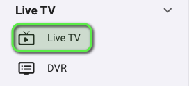
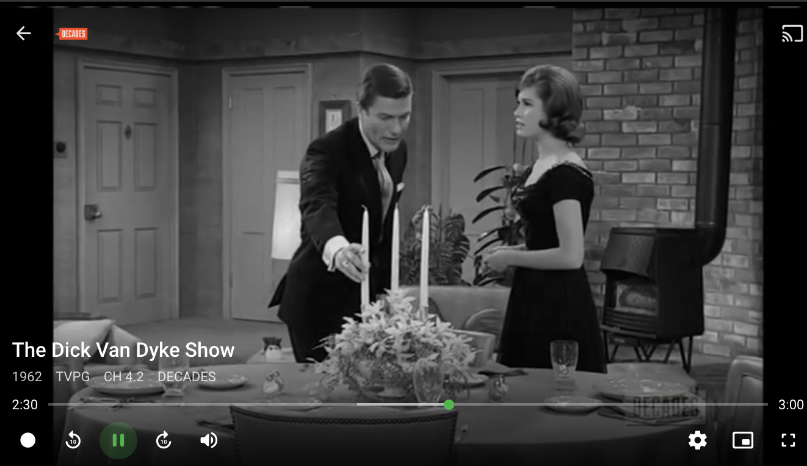

# Integrating locast2tuner with Emby

[Emby](https://emby.media/) supports both [HDHomerun](https://www.silicondust.com/) and m3u tuner modes, both of which are supported by `locast2tuner`.  This guide will walk you through adding your working `locast2tuner` tuner to Emby in m3u mode.

* In Emby, click the gear icon at the top right to go to settings. 

* In the left side bar, scroll down and click "Live TV" under "Live TV."

* You should be presented with this screen. Click the "+" sign beside "TV Sources."

* We have not yet enabled SSDP discovery in `locast2tuner`, so we will have to enter the `locast2tuner` address manually.  Click the "Type" dropdown box and select "M3U Tuner."

* Enter the URL of your locast2tuner server in `http://IP_ADDR:PORT/tuner.m3u` format and click "Connect."  Below we are using `http://10.19.71.3:6077/tuner.m3u`.

> If you are running `locast2tuner` in a Docker container in the same Docker network as PMS (or using docker-compose), you can enter the container name instead of the IP address.

* Click "Save." Emby should now show your `locast2tuner` as a TV source"

* Emby and `locast2tuner` both support XMLTV guides. Click the "+" sign beside "TV Guide Data Providers" to add our guide.

* Click the "Country" dropdown and select "United States" (locast only supports US markets currently).

* Click the "Guide source" dropdown and select "XmlTV."

* Click "Next."

In the "File or url" field, enter the URL to the XMLTV guide on `locast2tuner` in the format `http://IP_ADDR:PORT/epg.xml` and click "Save."  Below we are using `http://10.19.71.3:6077/epg.xml`.

> If you are running `locast2tuner` in a Docker container in the same Docker network as PMS (or using docker-compose), you can enter the container name instead of the IP address.

* Allow Emby to download the guide data from `locast2tuner` and you should now have both the tuner and guide sources listed on the screen.

* You're done!  On the Emby home screen, you should now see a Live TV section where you can jump to the guide to watch TV or set recordings.

[Return to the `locast2tuner` project](https://github.com/wouterdebie/locast2tuner)