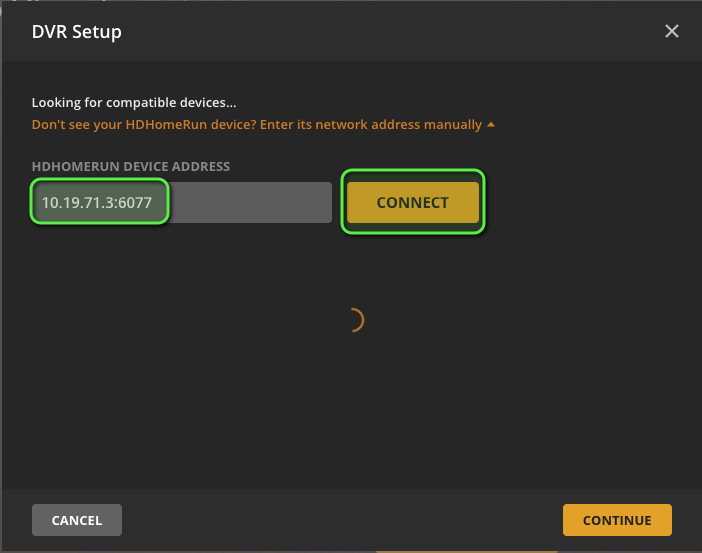
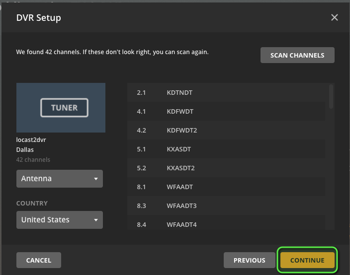
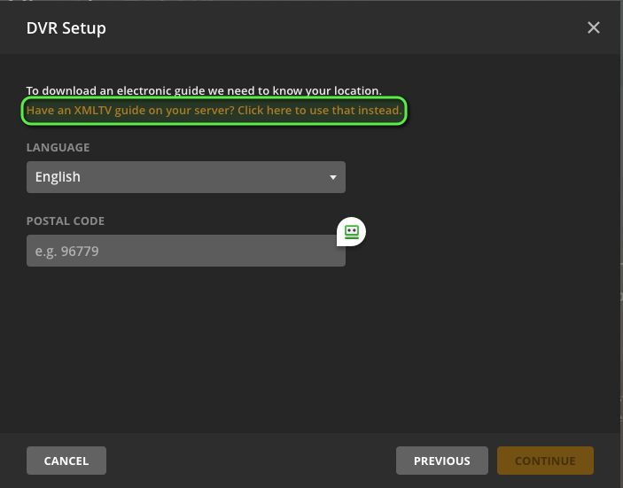
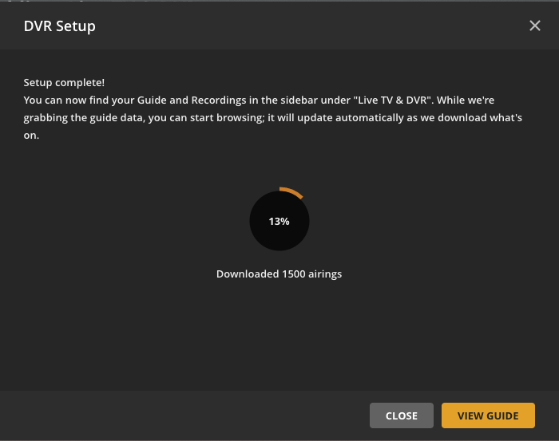
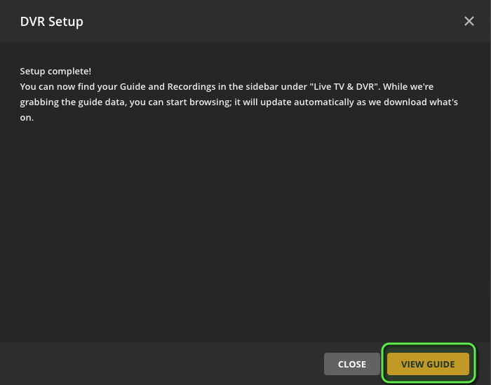
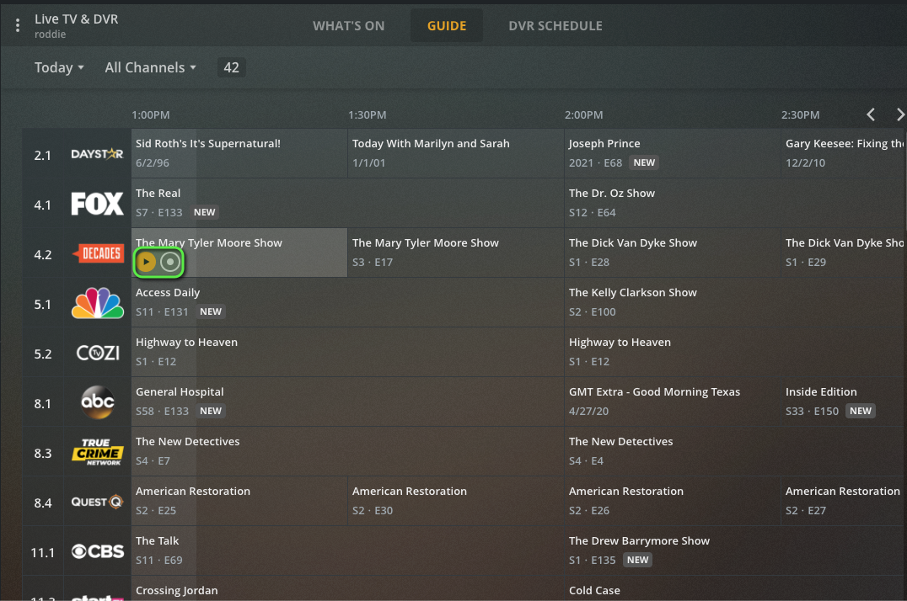
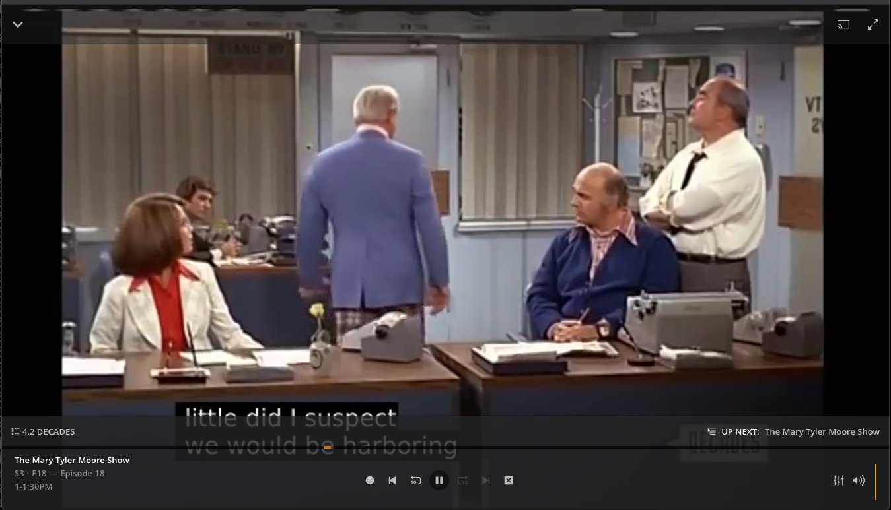

# Integrating with Plex Media Server

[Plex Media Server](https://www.plex.tv/) (PMS) only supports [HDHomerun](https://www.silicondust.com/) mode which is supported by `locast2tuner`.  This guide will walk you through adding your working `locast2tuner` tuner to PMS.

* In PMS, click the tools icon at the top right to go to settings.

* In the left side bar, scroll down and click "Live TV & DVR" under "Manage."

* You should be presented with this screen. If you have multiple servers in your PMS account, make sure that you focused on the local one. The name of the server in the below screenshot is "roddie."

* Click "Set up Plex DVR"

* Enter the `locast2tuner` address manually. Click the link shown in the screenshot to do this.

* Enter the IP address and TCP port of your locast2tuner server in `IP_ADDR:PORT` format and click "Connect."  Below we are using `10.19.71.3:6077`.

> If you are running `locast2tuner` in a Docker container in the same Docker network as PMS (or using docker-compose), you can enter the container name instead of the IP address.

* PMS should then find your `locast2tuner` and display the location.  Click "Continue."

* You'll then be shown a list of all of the channels that were found on your tuner. These are coming directly from Locast they should be accurate. You can click "Scan Channels" again if you think there are some missing.  Otherwise, click "Continue."

* PMS and `locast2tuner` both support XMLTV guides, so instead of pulling from a third-party source, click the link as shown in the screenshot.

For this field, enter the URL to the XMLTV guide on `locast2tuner` in the format `http://IP_ADDR:PORT/epg.xml` and click "Continue."  Below we are using `http://10.19.71.3:6077/epg.xml`.

> If you are running `locast2tuner` in a Docker container in the same Docker network as PMS (or using docker-compose), you can enter the container name instead of the IP address.

* Verify that the mappings are correct between your `locast2tuner` channels and the guide channels (they should be), and click "Continue."

* Wait for PMS to update the guide, which should only take a couple of minutes, and then click "View Guide" to go to your newly added TV guide.

* You're done!  You should now be able to click any show in the guide to either watch live or set a recording.

> You may sometimes experience a quick few second pause after the first couple of seconds before the show continues.  This is expected in HDHomerun mode.

[Return to the `locast2tuner` project](https://github.com/wouterdebie/locast2tuner)
